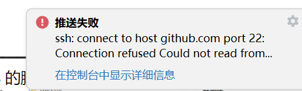
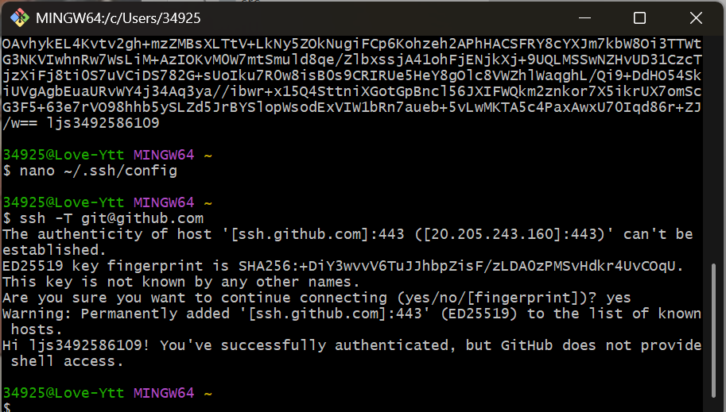
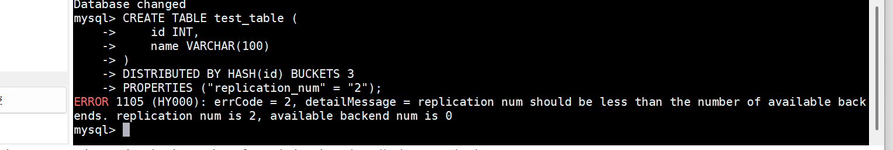
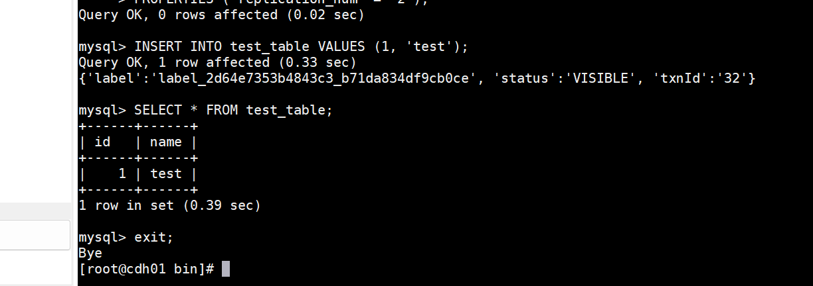

### 202507023 工作日报
* 1 今天上传git时遇到上传失败找到了原因是ssh秘钥有问题，
* 下载了一个Git Bash下载，从里面GitHub的SSH公钥已被永久加入本地已成功解决问题
* 
* 
* 2.doris安装可以启动连接到mysql，创建测试数据库和表时有一个问题是副本数replication_num设置值大于可用后端backend数量
* 这个问题正在努力解决
* 
* 已经完成doris
* 
* 3 完成了影刀高级考试并拿到了证书
* 